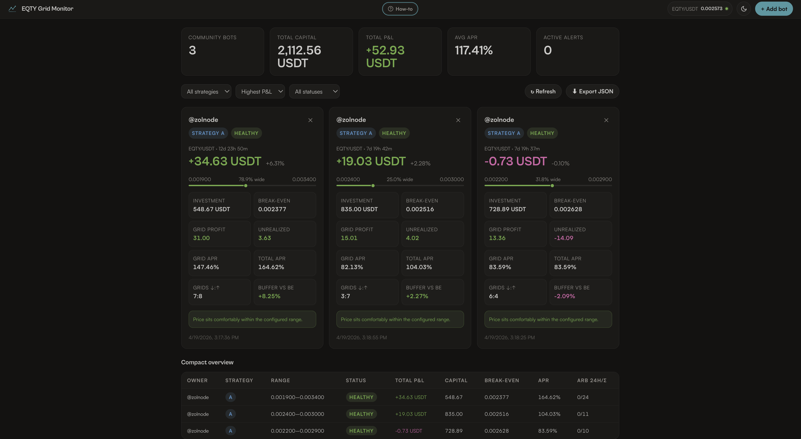

# EQTY Grid Monitor — v2

A community-shared, Supabase-backed dashboard for monitoring KuCoin Spot Grid bots on the EQTY/USDT pair.



---

## Features

- **Paste, API-sync, or Image Upload** bot snapshots:
  - Copy-paste text directly from KuCoin Web
  - Upload mobile app screenshots (powered by local, in-browser Tesseract OCR)
  - Connect read-only API keys for 5-minute auto-sync
- Live EQTY/USDT price from KuCoin public ticker (auto-refreshes every 30s)
- Per-bot range health alerts (healthy / near edge / out of range)
- KPI summary: total bots, capital, P&L, average APR, active alerts
- Filter by strategy (A–E), alert status, and sort by P&L / capital / alerts / newest
- Compact table + card grid views
- Export to JSON
- Light + dark mode
- 100% static — deploy to GitHub Pages or Cloudflare Pages

---

## 1 · Supabase setup

### Create project

1. Go to [supabase.com](https://supabase.com) and create a free project
2. Note your **Project URL** and **anon (public) key** from Settings → API

### Database setup

Run this SQL in the Supabase **SQL Editor**:

```sql
-- Main bots table
create table public.bots (
  id              uuid primary key default gen_random_uuid(),
  owner           text not null,
  strategy        text not null default 'Custom',
  note            text,
  pair            text default 'EQTY/USDT',
  snapshot_price  numeric,
  runtime         text,
  arb_24h         integer default 0,
  arb_total       integer default 0,
  investment      numeric default 0,
  total_profit    numeric default 0,
  total_profit_pct numeric default 0,
  grid_profit     numeric default 0,
  unrealized      numeric default 0,
  break_even      numeric,
  range_low       numeric,
  range_high      numeric,
  grid_balance    text,
  grid_apr        numeric default 0,
  apr             numeric default 0,
  api_linked      boolean default false,
  api_key_ref     text,    -- stores encrypted key reference (Edge Function only)
  created_at      timestamptz default now(),
  updated_at      timestamptz default now()
);

-- Allow anyone to read (public dashboard)
alter table public.bots enable row level security;
create policy "Public read" on public.bots for select using (true);
create policy "Public insert" on public.bots for insert with check (true);
create policy "Public delete" on public.bots for delete using (true);

-- Auto-update timestamp
create or replace function handle_updated_at()
returns trigger as $$
begin new.updated_at = now(); return new; end;
$$ language plpgsql;
create trigger set_updated_at before update on public.bots
  for each row execute procedure handle_updated_at();
```

### Connect the dashboard

Open `config.js` and replace the two placeholders:

```js
const SUPABASE_URL  = 'https://YOUR_PROJECT_ID.supabase.co';
const SUPABASE_ANON = 'YOUR_ANON_KEY';
```

---

## 2 · Deploy to GitHub Pages

```bash
# Create repo and push
git init
git add .
git commit -m "Initial deploy"
git remote add origin https://github.com/YOUR_ORG/eqty-grid-monitor.git
git push -u origin main
```

Then in GitHub → Settings → Pages → Source: **Deploy from branch `main` / root**.

Your dashboard will be live at:
`https://YOUR_ORG.github.io/eqty-grid-monitor/`

---

## 3 · API auto-sync (optional, advanced)

Community members can optionally provide their **read-only** KuCoin API key so their bot stats update automatically every 5 minutes.

### How it works

1. User fills the "API key sync" tab in the Add Bot modal
2. Credentials are sent to a **Supabase Edge Function** (`sync-kucoin-bot`)
3. The Edge Function:
   - Validates the key is read-only (no trade/withdraw scope)
   - Encrypts the credentials using Supabase Vault
   - Calls `GET /api/v2/grid/spot/bots` on KuCoin to fetch current stats
   - Stores the bot stats in the `bots` table (credentials are never exposed to the frontend)
4. A scheduled Edge Function (cron) re-syncs all API-linked bots every 5 minutes

### Deploy the Edge Function

```bash
# Install Supabase CLI
npm install -g supabase

# Login
supabase login

# Link to your project
supabase link --project-ref YOUR_PROJECT_ID

# Deploy the sync function
supabase functions deploy sync-kucoin-bot --no-verify-jwt
```

The Edge Function source is in `supabase/functions/sync-kucoin-bot/index.ts`.

---

## 4 · KuCoin API availability

| Data point | Public API | Authenticated API |
|---|---|---|
| EQTY/USDT live price | ✅ `GET /api/v1/market/orderbook/level1` | — |
| Bot list & stats | ❌ | ✅ `GET /api/v2/grid/spot/bots` |
| Bot P&L detail | ❌ | ✅ `GET /api/v2/grid/spot/bot/detail` |
| Arbitrage history | ❌ | ✅ `GET /api/v2/grid/spot/bot/orders` |

**The live price widget always works.** Bot stats from the API require each community member to optionally share their read-only key.

---

## Strategy reference

| Label | Range | Grids | Min USDT | Role |
|---|---|---|---|---|
| A – Starter | 0.0023–0.0031 | 8 | 100 | Easy entry, centered on current price |
| B – Core | 0.0022–0.0032 | 10 | 200 | Balanced mid-range |
| C – Wide | 0.0020–0.0034 | 12 | 400 | Max arbitrage cycles |
| D – Bull | 0.0026–0.0038 | 10 | 200 | Upside skewed |
| E – Dip | 0.0018–0.0030 | 10 | 200 | Downside coverage |

---

## Local dev

Just open `index.html` in a browser. No build step required. The OCR processing runs entirely inside the browser using Tesseract.js.
